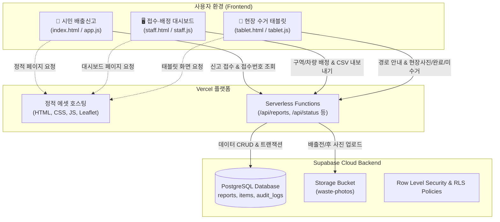

# 🚛 제천시 대형폐기물 스마트 배출·수거 관리 시스템

> **시민 배출신고 · 접수 및 차량 배정 · 현장 기사 태블릿 수거 · 데이터 정합성 검증까지 원스톱 지원하는 위치기반 공공 행정 시스템**  
> 아키텍처: **GitHub + Supabase (PostgreSQL / Storage) + Vercel (Frontend & Serverless Functions)**

---

## 🏗️ 시스템 아키텍처



---

## ✨ 3대 핵심 사용자 화면

1. **📱 시민 배출신고 (`/index.html`)**
   - 스티커 구매 방문 없이 약 3분 만에 온라인 신고 및 접수번호 발급
   - 스마트 품목 검색 (초성·동의어 지원) 및 규격별 예상 수수료 자동 계산
   - 지도 기반 배출 위치 지정 및 배출 현장 사진 촬영/등록
   - 간편결제(카카오·네이버·토스), 신용카드, 무통장입금, 현금결제 지원
   - 접수번호 기반 실시간 수거 진행 상태 및 수거 완료 사진 확인

2. **🖥️ 접수 담당자 대시보드 (`/staff.html`)**
   - 실시간 신규 접수 현황 모니터링 및 3대 수거구역(청전·의림, 중앙·교동, 하소·영천) 차량 배정
   - 보완 요청 및 부적합 신고 반려 처리, 현금 납부 건 수납 확인
   - 전체 신고 내역 CSV 엑셀 다운로드
   - 데이터 정합성 검증 탭: 미배정 장기 대기건, 위치 누락건 등 사전 탐지

3. **🚜 현장 수거 기사 전용 태블릿 모드 (`/tablet.html`)**
   - 차량 기사 맞춤형 2열 분할 UI (좌측 수거 목록, 우측 지도 & 상세 정보)
   - 오늘 할당된 배정 건 자동 로딩 및 실제 이동 거리 기반 길찾기 지원
   - 현장 수거 완료 사진 촬영 및 즉시 상태 갱신
   - 현장 폐기물 부재 시 '미수거 사유 등록', 규격 상이 시 '현장 변경 요청' 처리

---

## 🗄️ Supabase 데이터베이스 & 스토리지 설정

### 1. 스키마 마이그레이션 실행
1. [Supabase 대시보드](https://supabase.com/dashboard)에서 프로젝트를 생성합니다.
2. 좌측 메뉴의 **SQL Editor**로 이동합니다.
3. `supabase/migrations/20260914000000_initial_schema.sql` 파일의 내용을 복사하여 실행합니다.
   - `reports` (신고 내역)
   - `report_items` (신고 품목 상세)
   - `audit_logs` (작업 감사 로그)
   - RLS 정책 및 인덱스
   - `waste-photos` 스토리지 버킷 자동 생성
4. (선택사항) 초기 샘플 데이터가 필요하면 `supabase/seed.sql`을 실행합니다.

### 2. 스토리지 버킷 확인
- **Storage** > `waste-photos` 버킷이 `Public`으로 설정되어 있는지 확인합니다.
- 사진 촬영 시 배출 전/후 사진이 안전하게 클라우드 버킷에 보관됩니다.

---

## 🚀 Vercel 배포 방법

본 프로젝트는 Vercel Serverless Functions와 정적 파일 호스팅으로 완벽히 구성되어 있습니다.

### 방법 1: GitHub 연동 자동 배포 (권장)
1. GitHub 저장소(`ChoiJC79/jecheon-bulky-waste`)에 최신 코드를 푸시합니다.
2. [Vercel 대시보드](https://vercel.com)에서 **Add New... > Project**를 선택합니다.
3. GitHub 계정에서 `jecheon-bulky-waste` 저장소를 **Import**합니다.
4. **Environment Variables**에 아래 환경 변수를 등록합니다:
   ```env
   SUPABASE_URL=https://your-project-id.supabase.co
   SUPABASE_ANON_KEY=your-anon-key
   SUPABASE_SERVICE_ROLE_KEY=your-service-role-key
   SUPABASE_STORAGE_BUCKET=waste-photos
   ```
5. **Deploy** 버튼을 클릭하면 1분 이내에 배포가 완료됩니다!

---

## 💻 로컬 개발 및 테스트

```bash
# 의존성 패키지 설치
npm install

# 로컬 개발 서버 구동 (포트 4173)
npm run dev

# 테스트 스위트 실행 (10개 테스트 케이스 검증)
npm test
```

> **💡 하위 호환성 (SQLite 폴백):**  
> Supabase 환경 변수가 등록되지 않은 로컬 환경에서는 내장 SQLite(`data/waste.db`)와 로컬 업로드(`uploads/`)로 자동 전환되어 오프라인에서도 모든 기능 및 테스트가 정상 동작합니다.

---

## 📂 디렉토리 구조

```
├── api/                           # Vercel Serverless Functions
│   ├── health.js                  # 헬스체크
│   ├── staff-assignees.js         # 담당자 및 구역 목록
│   ├── verification.js            # 데이터 정합성 검증 API
│   ├── reports/
│   │   ├── index.js               # GET(목록) / POST(신규 신고 접수)
│   │   ├── export.js              # GET(CSV 내보내기)
│   │   └── [reportNo]/
│   │       ├── index.js           # GET(단건 상세조회)
│   │       └── status.js          # PATCH(배정, 완료, 미수거 등 상태변경)
│   └── lib/
│       └── supabase.js            # Supabase 클라이언트 & SQLite 폴백
├── supabase/                      # Supabase 설정 및 마이그레이션
│   ├── config.toml                # Supabase CLI 설정
│   ├── migrations/                # PostgreSQL DDL & RLS 정책
│   └── seed.sql                   # 초기 샘플 데이터
├── index.html                     # 시민 배출신고 메인 화면
├── staff.html                     # 내부 접수·배정 및 데이터 검증 대시보드
├── tablet.html                    # 현장 수거 전용 태블릿 웹 화면
├── app.js                         # 시민 화면 인터랙션 로직
├── staff.js                       # 접수 대시보드 로직
├── tablet.js                      # 태블릿 수거 기사 전용 로직
├── photo.js                       # 이미지 압축 및 인코딩
├── styles.css                     # 공통 및 시민/접수 화면 스타일
├── tablet.css                     # 현장 수거 태블릿 전용 스타일
├── server.mjs                     # 로컬 개발용 HTTP 서버
├── vercel.json                    # Vercel 라우팅 및 배포 설정
└── package.json                   # 프로젝트 설정 및 의존성
```
